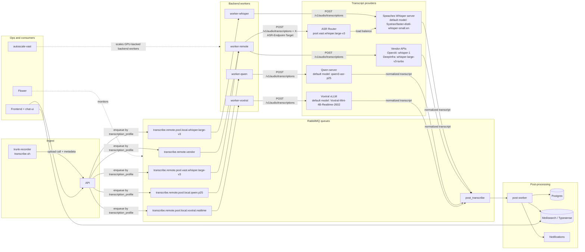

# Architecture

This document complements the top-level README with a compact system diagram, a backend reference table, and the shared transcription runtime contract.

## Diagram Conventions

- One diagram should answer one question. The main diagram below focuses on runtime flow, not every container detail.
- Components are grouped by responsibility so the reader can scan left to right: ingest, routing, backend execution, post-processing, and consumers.
- Provider nodes include the default model where that adds useful context.
- The important execution boundary is the transcription API contract, not provider-specific SDK code.
- Operational components such as Flower and the autoscaler are shown off the main transcript path.

## System Flow

## Default Backend Stacks

| Profile | Queue | Worker compose | Provider server | Default model |
| --- | --- | --- | --- | --- |
| `kind=vendor;provider=openai;model=whisper-1` | `transcribe.remote.vendor` | `docker-compose.worker-api.yml` | OpenAI | `whisper-1` |
| `kind=pool;platform=local;family=whisper;variant=large-v3;...` | `transcribe.remote.pool.local.whisper.large-v3` | `docker-compose.worker-whisper.yml` | `ghcr.io/speaches-ai/speaches` | `Systran/faster-whisper-large-v3` |
| `kind=pool;platform=local;family=qwen;variant=p25;...` | `transcribe.remote.pool.local.qwen.p25` | `docker-compose.worker-qwen.yml` | `ghcr.io/trunk-reporter/qwen3-asr-server:gpu` | `qwen3-asr-p25` |
| `kind=pool;platform=local;family=voxtral;variant=realtime;...` | `transcribe.remote.pool.local.voxtral.realtime` | `docker-compose.worker-voxtral.yml` | `vllm/vllm-openai:latest` | `mistralai/Voxtral-Mini-4B-Realtime-2602` |
| `kind=pool;platform=vast;family=whisper;variant=large-v3;...` | `transcribe.remote.pool.vast.whisper.large-v3` | `docker-compose.worker-api.yml` + `asr-router` | Vast ASR pool | `Systran/faster-whisper-large-v3` |

## Runtime Contract

All active transcription backends in this repo now use the same runtime contract:

- the worker sends audio to an OpenAI-compatible `POST /v1/audio/transcriptions` endpoint
- the provider returns a verbose JSON transcript
- the worker normalizes that response into the shared transcript shape used by `post_transcribe`

That means queue routing is still backend-specific, but execution is no longer split between local ASR servers and separate in-process provider SDK implementations.

## Notes

- Each machine should run one profile-specific worker stack plus any shared infrastructure it needs to reach RabbitMQ and the API.
- The worker normalizes transcripts before handing them to the shared `post_transcribe` flow.
- Vendor profiles are forwarding-only and do not need GPU capacity.
- `autoscale-vast` manages one ASR pool queue per autoscaler instance.
- Flower observes queue and worker state; it is not on the transcript data path.
