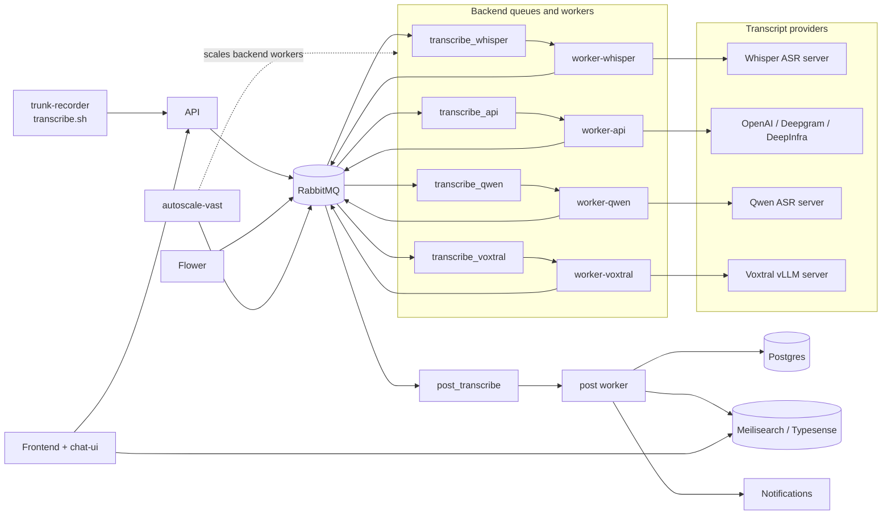
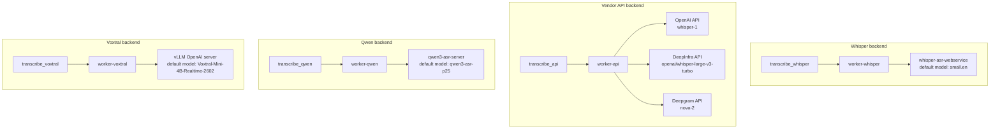

# Architecture

This document complements the top-level README with compact Mermaid diagrams for the deployed system and the transcription provider stack.

## Runtime Topology

## Transcript Providers And Models

## Default Backend Stacks

| Backend | Queue | Worker compose | Provider server | Default model |
| --- | --- | --- | --- | --- |
| Whisper | `transcribe_whisper` | `docker-compose.worker-whisper.yml` | `onerahmet/openai-whisper-asr-webservice` | `small.en` |
| API | `transcribe_api` | `docker-compose.worker-api.yml` | OpenAI, Deepgram, or DeepInfra | Provider-specific |
| Qwen | `transcribe_qwen` | `docker-compose.worker-qwen.yml` | `ghcr.io/trunk-reporter/qwen3-asr-server:gpu` | `qwen3-asr-p25` |
| Voxtral | `transcribe_voxtral` | `docker-compose.worker-voxtral.yml` | `vllm/vllm-openai:latest` | `mistralai/Voxtral-Mini-4B-Realtime-2602` |

## Notes

- Each machine should run one backend-specific worker stack plus any shared infrastructure it needs to reach RabbitMQ and the API.
- The backend worker normalizes transcripts before handing them to the shared `post_transcribe` flow.
- `autoscale-vast` should manage one backend queue per autoscaler instance.
- Flower observes queue and worker state; it is not on the transcript data path.
