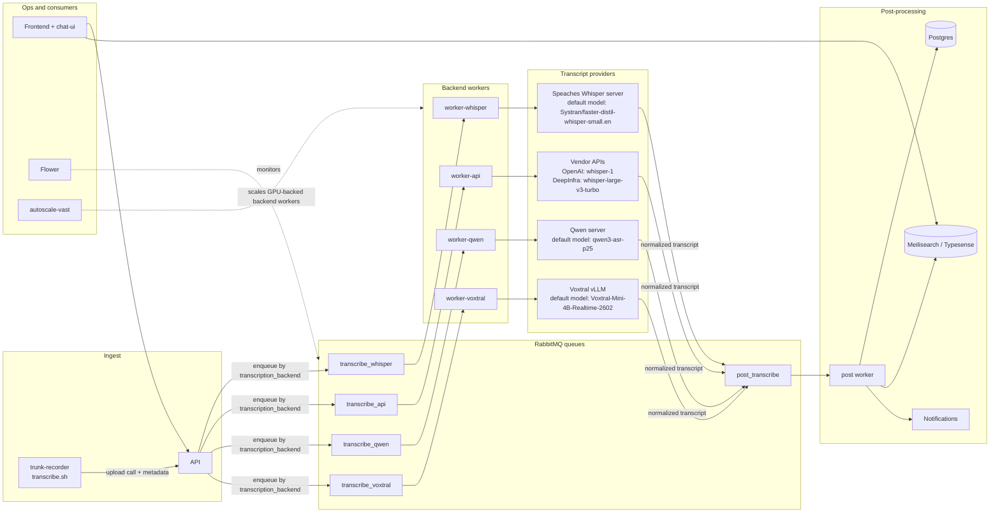

# Architecture

This document complements the top-level README with a compact system diagram and a backend reference table.

## Diagram Conventions

- One diagram should answer one question. The main diagram below focuses on runtime flow, not every container detail.
- Components are grouped by responsibility so the reader can scan left to right: ingest, routing, backend execution, post-processing, and consumers.
- Provider nodes include the default model where that adds useful context.
- Operational components such as Flower and the autoscaler are shown off the main transcript path.

## System Flow

## Default Backend Stacks

| Backend | Queue | Worker compose | Provider server | Default model |
| --- | --- | --- | --- | --- |
| Whisper | `transcribe_whisper` | `docker-compose.worker-whisper.yml` | `ghcr.io/speaches-ai/speaches` | `Systran/faster-distil-whisper-small.en` |
| API | `transcribe_api` | `docker-compose.worker-api.yml` | OpenAI, Deepgram, or DeepInfra | Provider-specific |
| Qwen | `transcribe_qwen` | `docker-compose.worker-qwen.yml` | `ghcr.io/trunk-reporter/qwen3-asr-server:gpu` | `qwen3-asr-p25` |
| Voxtral | `transcribe_voxtral` | `docker-compose.worker-voxtral.yml` | `vllm/vllm-openai:latest` | `mistralai/Voxtral-Mini-4B-Realtime-2602` |

## Notes

- Each machine should run one backend-specific worker stack plus any shared infrastructure it needs to reach RabbitMQ and the API.
- The backend worker normalizes transcripts before handing them to the shared `post_transcribe` flow.
- The `api` backend is forwarding-only and does not need GPU capacity.
- `autoscale-vast` should manage one backend queue per autoscaler instance.
- Flower observes queue and worker state; it is not on the transcript data path.
