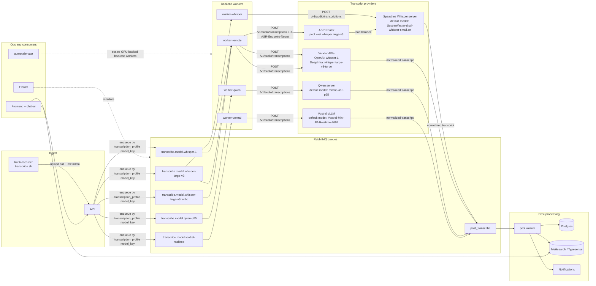

# Architecture

This document complements the top-level README with a compact system diagram, a backend reference table, and the shared transcription runtime contract.

## Diagram Conventions

- One diagram should answer one question. The main diagram below focuses on runtime flow, not every container detail.
- Components are grouped by responsibility so the reader can scan left to right: ingest, routing, backend execution, post-processing, and consumers.
- Provider nodes include the default model where that adds useful context.
- The important execution boundary is the transcription API contract, not provider-specific SDK code.
- Operational components such as Flower and the autoscaler are shown off the main transcript path.

## System Flow

```mermaid
flowchart LR
    subgraph INGEST[Ingest]
        TR[trunk-recorder<br/>transcribe.sh]
        API[API]
    end

    subgraph QUEUES[RabbitMQ queues]
        QW1[transcribe.model.whisper-1]
        QWL[transcribe.model.whisper-large-v3]
        QWT[transcribe.model.whisper-large-v3-turbo]
        QQL[transcribe.model.qwen-p25]
        QVL[transcribe.model.voxtral-realtime]
        QP[post_transcribe]
    end

    subgraph EXEC[Backend workers]
        WR[worker-remote]
        WP[worker-whisper]
        WQ[worker-qwen]
        WV[worker-voxtral]
    end

    subgraph PROVIDERS[Transcript providers]
        PW[Speaches Whisper server<br/>default model: Systran/faster-distil-whisper-small.en]
        PA[Vendor APIs<br/>OpenAI: whisper-1<br/>DeepInfra: whisper-large-v3-turbo]
        PQW[Qwen server<br/>default model: qwen3-asr-p25]
        PV[Voxtral vLLM<br/>default model: Voxtral-Mini-4B-Realtime-2602]
        PR[ASR Router<br/>pool.vast.whisper.large-v3]
    end

    subgraph POSTPROC[Post-processing]
        POST[post worker]
        DB[(Postgres)]
        SEARCH[(Meilisearch / Typesense)]
        NOTIFY[Notifications]
    end

    subgraph OPS[Ops and consumers]
        UI[Frontend + chat-ui]
        FLOWER[Flower]
        AUTO[autoscale-vast]
    end

    TR -->|upload call + metadata| API
    API -->|enqueue by transcription_profile model_key| QW1
    API -->|enqueue by transcription_profile model_key| QWL
    API -->|enqueue by transcription_profile model_key| QWT
    API -->|enqueue by transcription_profile model_key| QQL
    API -->|enqueue by transcription_profile model_key| QVL

    QW1 --> WR -->|POST /v1/audio/transcriptions| PA
    QWL --> WP -->|POST /v1/audio/transcriptions| PW
    QWL --> WR -->|POST /v1/audio/transcriptions + X-ASR-Endpoint-Target| PR
    QWT --> WR -->|POST /v1/audio/transcriptions| PA
    QQL --> WQ -->|POST /v1/audio/transcriptions| PQW
    QVL --> WV -->|POST /v1/audio/transcriptions| PV
    PR -->|load balance| PW

    PW -->|normalized transcript| QP
    PA -->|normalized transcript| QP
    PQW -->|normalized transcript| QP
    PV -->|normalized transcript| QP

    QP --> POST
    POST --> DB
    POST --> SEARCH
    POST --> NOTIFY

    UI --> API
    UI --> SEARCH
    FLOWER -. monitors .-> QUEUES
    AUTO -. scales GPU-backed backend workers .-> EXEC
```

## Default Backend Stacks

| Profile | Queue | Worker compose | Provider server | Default model |
| --- | --- | --- | --- | --- |
| `kind=vendor;model_key=whisper-1;provider=openai;model=whisper-1` | `transcribe.model.whisper-1` | `docker-compose.worker-api.yml` | OpenAI | `whisper-1` |
| `kind=vendor;model_key=whisper-large-v3-turbo;provider=cloudflare;model=@cf/openai/whisper-large-v3-turbo` | `transcribe.model.whisper-large-v3-turbo` | `docker-compose.worker-api.yml` | Cloudflare Workers AI | `@cf/openai/whisper-large-v3-turbo` |
| `kind=pool;model_key=whisper-large-v3;platform=local;family=whisper;variant=large-v3;...` | `transcribe.model.whisper-large-v3` | `docker-compose.worker-whisper.yml` | `ghcr.io/speaches-ai/speaches` | `Systran/faster-whisper-large-v3` |
| `kind=pool;model_key=qwen-p25;platform=local;family=qwen;variant=p25;...` | `transcribe.model.qwen-p25` | `docker-compose.worker-qwen.yml` | `ghcr.io/trunk-reporter/qwen3-asr-server:gpu` | `qwen3-asr-p25` |
| `kind=pool;model_key=voxtral-realtime;platform=local;family=voxtral;variant=realtime;...` | `transcribe.model.voxtral-realtime` | `docker-compose.worker-voxtral.yml` | `vllm/vllm-openai:latest` | `mistralai/Voxtral-Mini-4B-Realtime-2602` |
| `kind=pool;model_key=whisper-large-v3;platform=vast;family=whisper;variant=large-v3;...` | `transcribe.model.whisper-large-v3` | `docker-compose.worker-api.yml` + `asr-router` | Vast ASR pool | `Systran/faster-whisper-large-v3` |

## Runtime Contract

Most active transcription backends in this repo use the same runtime contract:

- the worker sends audio to an OpenAI-compatible `POST /v1/audio/transcriptions` endpoint
- the provider returns a verbose JSON transcript
- the worker normalizes that response into the shared transcript shape used by `post_transcribe`

Cloudflare Workers AI is the vendor exception: the worker sends base64 audio to Cloudflare's `/client/v4/accounts/{account_id}/ai/run/{model}` endpoint and normalizes the returned Workers AI transcript into the same shared shape.

That means queue routing is model-specific, while execution strategy stays worker-specific.

## Notes

- Each machine should run one model-specific worker stack plus any shared infrastructure it needs to reach RabbitMQ and the API.
- The worker normalizes transcripts before handing them to the shared `post_transcribe` flow.
- Vendor profiles are forwarding-only and do not need GPU capacity.
- `autoscale-vast` watches one model queue per autoscaler instance while using `ASR_POOL` for Vast instance discovery.
- Flower observes queue and worker state; it is not on the transcript data path.
